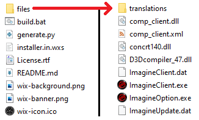

### Prerequisites

The following tools are needed to build an installer:
* [WiX Toolset](https://wixtoolset.org/)
* [Python 3.x](https://www.python.org/)

### Building

Start by editing `installer.in.wxs` as needed. Please generate a new [UUID/GUID](https://www.uuidgenerator.net/) for the product ID, upgrade code and application shortcuts. Do not remove the `@MEDIA@`, `@FILES@` and `@COMPONENT_REFS@` lines as these will be replaced by the Python script.

> **WARNING:** Failure to replace the existing UUID/GUIDs may result in your installer conflicting with an installer from another server.

You may wish to adjust the name of the application, version, manufacturer, shortcut and `TARGETDIR` to fit the needs of your server. You may also wish to write your own `License.rtf`. Finally, you may wish to replace the `wix-background.png`, `wix-banner.png` and `wix-icon.ico` to match your server branding.

Place the desired files into a subdirectory called `files`:

Once ready, run the `build.bat` script to generate an `installer.msi` file. Rename as desired.

> **NOTE:** You may need to edit the `build.bat` and adjust the path to WiX near the top of the file.

> **NOTE:** The warning about the file `mss32.dll` may be safely ignored.
